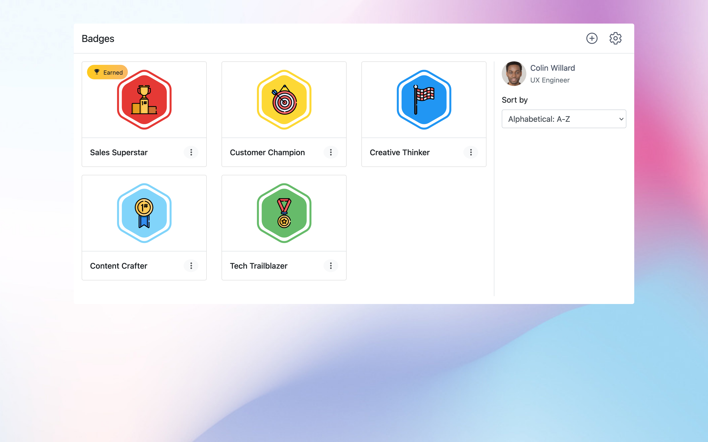
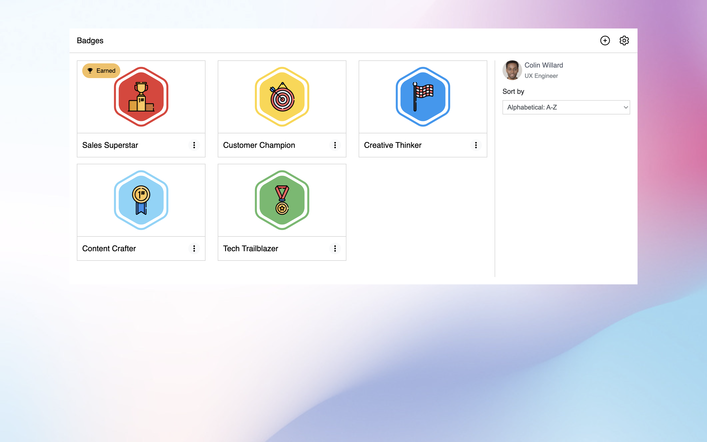
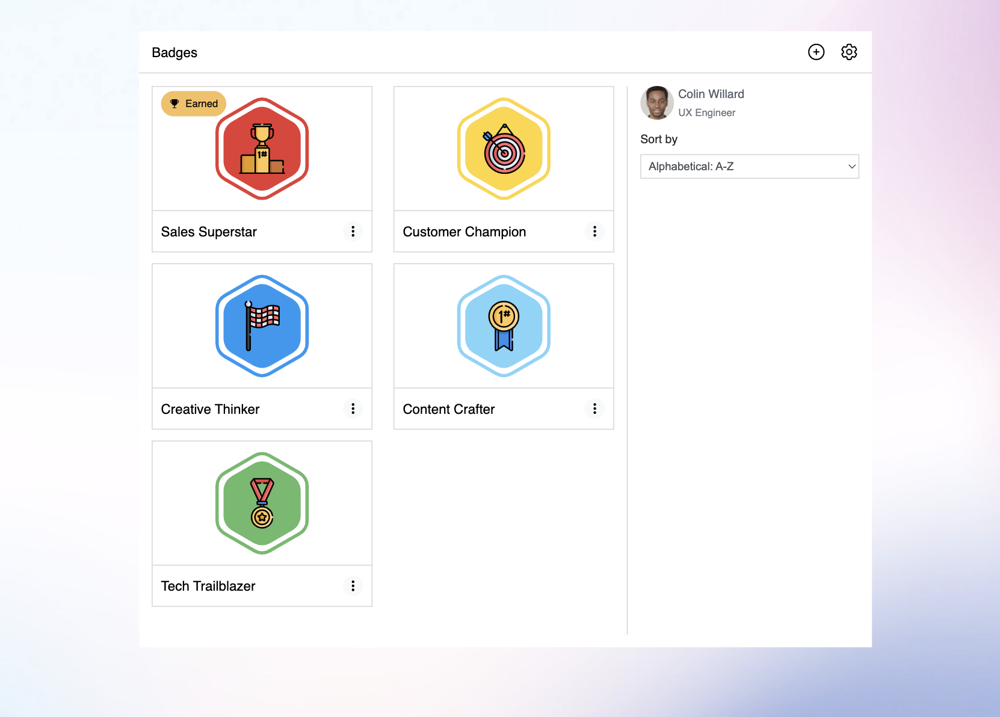
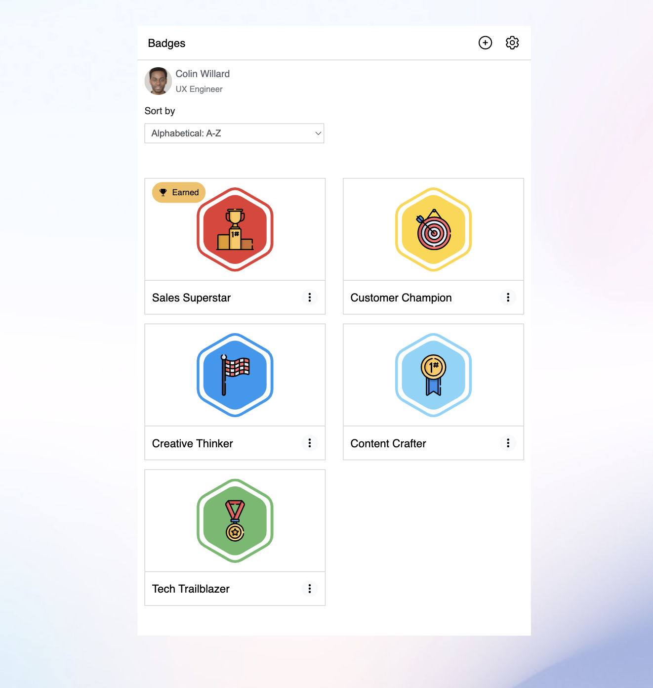
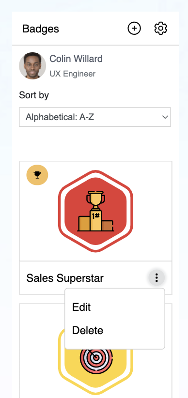
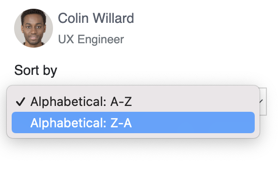
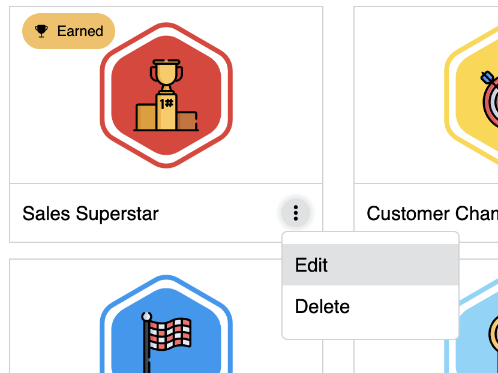
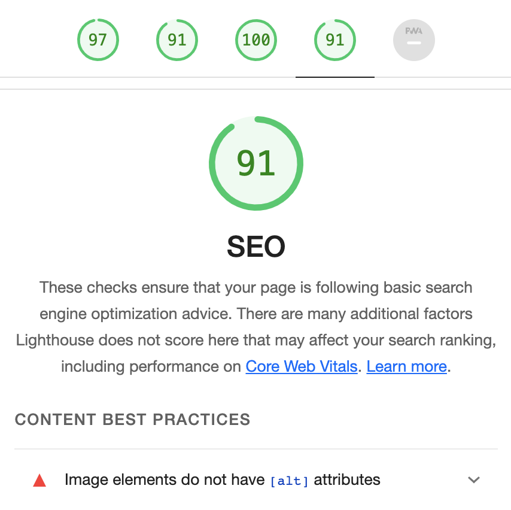
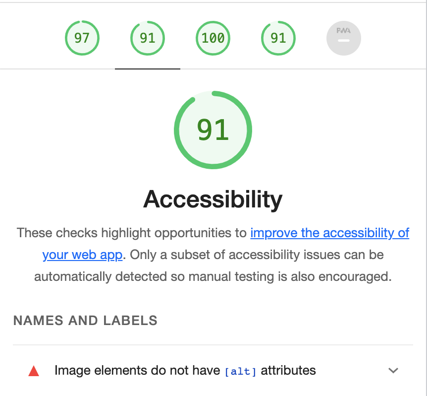
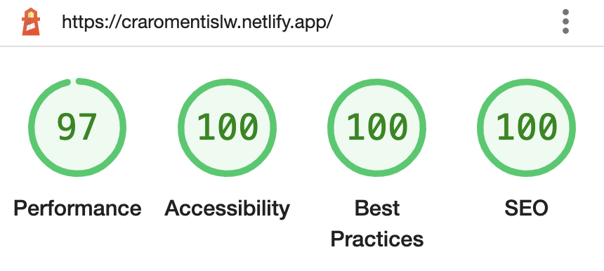

# Junior Front End Code Task

## - NOTE: Scroll down for completed task documantation

The goal of this task is to implement the example of a page in the screen capture ([fig.1](#example---fig1)) as closely as you can using any tools/frameworks you choose, code the dropdown menu interaction using JavaScript (as shown in the screen capture - [fig.2](#dropdown-example---fig2)).

The starter project already contains:

- the `index.html` file
- the image assets required to complete the task

### Assessment Criteria

Please spend no more than 1-2 hours on the task.

Submissions wil be assessed on:

- Code quality, readability/clarity and reusability
- "Best practice" implementation
- Responsiveness (mobile/tablet friendly)

Don't worry if it's not fully complete by the end, we don't expect a pixel perfect recreation.

### Example - fig.1

### Dropdown Example - fig.2

# COMPLETED TASK

Here is the result of the Front End build. To complete this, I used React.js and Styled Components. This enabled me to build reusable components whilst using minimal code.

The build is closely matched to the design spec and is responsive from mobile through to desktop.

Making it responsive to other device sizes, I set the layout to what I thougth worked best.

As the width decreases to a natural breakpoint, I would simply lay out the component so displays with less columns.

With the mobile being only 1 column, I set the custom dropdown to display inward rather than outward. This was to ensure it didn't go out of the app container.

Furthermore, the width at mobile size was responsive, so the trophy badge text was removed so it didn't overlap the main badge - maintaining a clean UI.

## DEPLOYED SITE

Here's a link to the deployed site. Check it out if you have a chance!

[Deployed Site](https://craromentislw.netlify.app/)

## MAIN CHALLENGE

The main challenge was to make the dropdown menu (Edit, Delete) for the badge component.

Initially I tried using the html select element, which is designed for this job. However, if found that styling the options was particuarly challenging.

NOTE - I set the profile dropdown using the default select element for style comparison:

To get around this, I built a custom dropdown menu. This enabled me to build it to the design spec.

With this came a new challenge, which was the off dropdown mouse click to close the dropdown. The quickest solution for this was to implement a transparent overlay covering the screen, that is "visible" when the dropdown is opened, and when clicked triggers the dropdown state to closed (false). This enabled a click anywhere outside of the dropdown to close it.

## LIGHTHOUSE SCORE

Once the project was finished I ran a lighthouse test. It received the following scores:

A quick win for accessibility and SEO optimisation was to add an Alt tag for the profile image. I went back and passed it in and then ran the lighthouse test again and received the following score:

